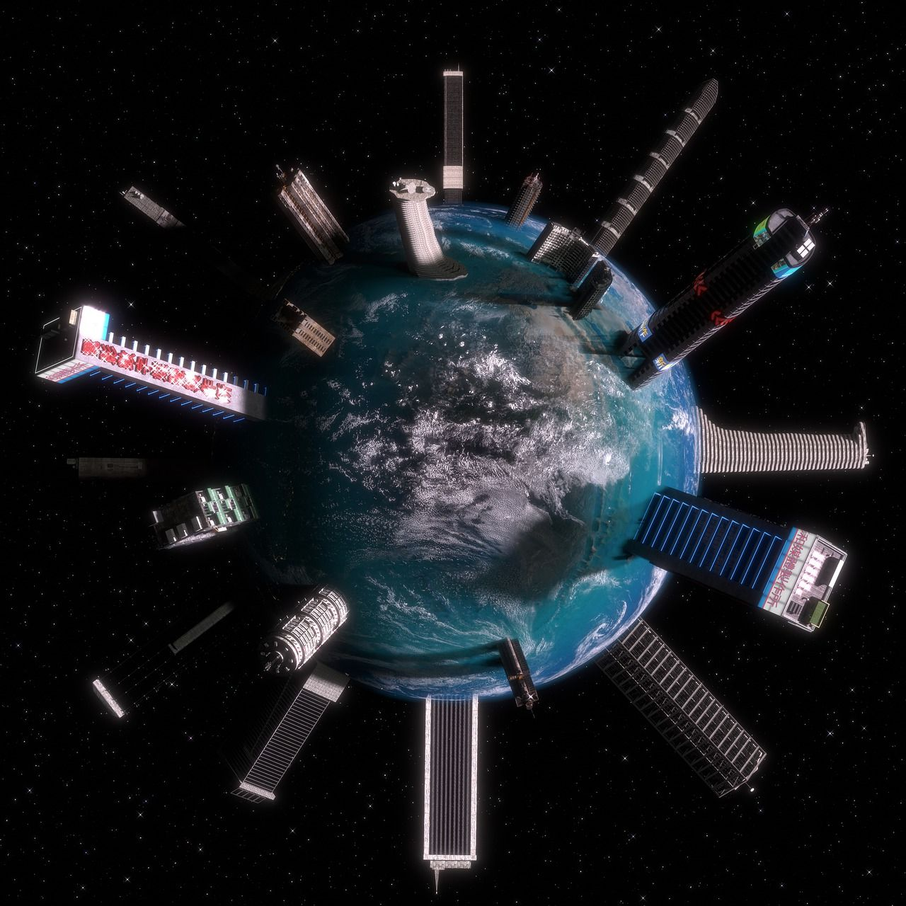

# semesterproject1

semesterproject starting

    <ul>
    
        <li class="l1"><a href="#">News&events</a></li>
        <li class="l2"><a href="#">Explor</a></li>
        <li class="l3"><a href="#">exhibition</a></li>
    </ul>

.visitmain {
position: relative;
max-width: 500px;
padding: 20px;
display: flex;
flex-direction: row;
flex: 1;
}
.maininfo {
position: absolute;
}
.img2 {
position: relative;
max-width: 500px;
padding: 20px;
flex: 1;
}
.img2text {
position: absolute;
top: 50%;
left: 50%;
transform: translate(-50%, -50%);
padding: 10px;
background-color: rgb(41, 41, 41, 0.8);
line-height: 20px;
}

Welcome to the digital gateway to an unparalleled journey through time, culture, and creativity. At [Your Museum Name], we invite you to embark on an extraordinary adventure as we showcase the beauty, history, and diversity of the world's heritage.

<h1></h1>

<h4>Teachers & students</h4>
As a community-driven museum, we want to work with schools to create places of learning and exploring. Our team are on hand to give your students guided tours of the museum, teach them in our learning laboratory, and provide great video presentations that will excite and inspire them.
    Please get in touch with us here to find out more about our facilities and to arrange a time to bring your students through for a visit.
    
Are you looking to get involved with our team of researchers and academics? Our museum offers various ways for you to use our resources and contribute towards them. We have online records, laboratory space, and a working relationship with a number of universities around the country.

  

<h4></a>Researchers</h4>
Are you looking to get involved with our team of researchers and academics? Our museum offers various ways for you to use our resources and contribute towards them. We have online records, laboratory space, and a working relationship with a number of universities around the country.

<h1>Explor</h1>

The unknown holds the keys to both our fears and our greatest discoveries.

  
Dive inn and explor our museum

<ul><li><a href="Kids">For Kids <i class="fas fas fas fas fa-child"></i></a></li><li><a href="Teachers">For Theacher <i class="fas fas fas fa-book"></i></a></li><li><a href="researchers"> For Researchers <i class="fas fas fas fa-bacteria"></i> </a></li></ul>

       

<h2>Admission?</h2>
The entrance is free for all.
            There are guided tours of the museum that leave every hour. These tours are 70 NOK per person and include a handy printed guide of the museum.
 <button>Book Guide</button>

   </div
